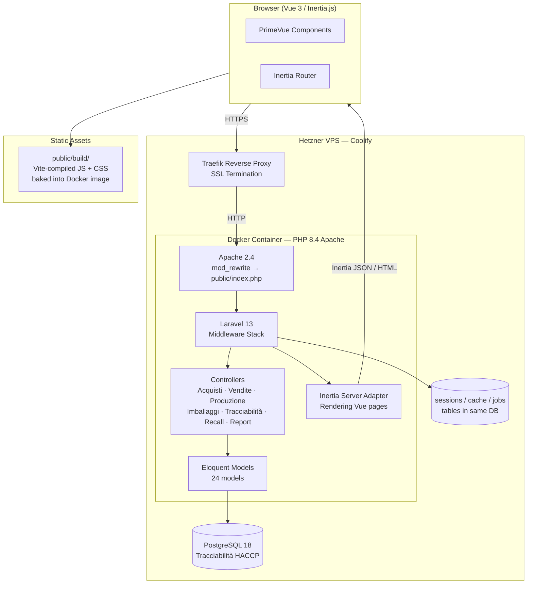
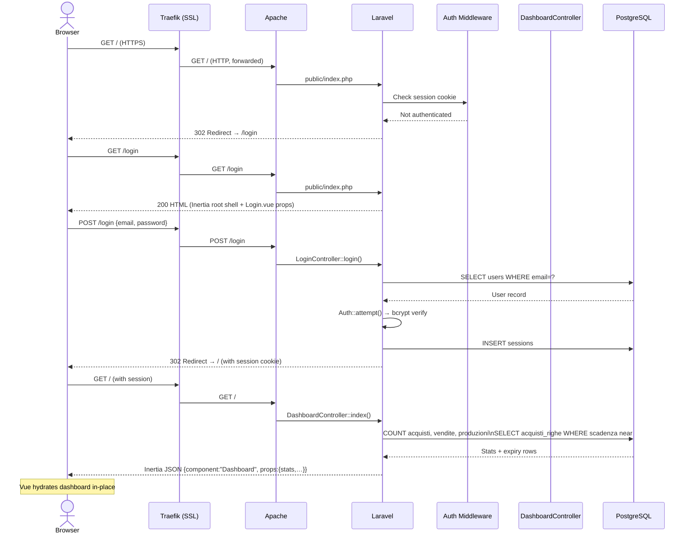
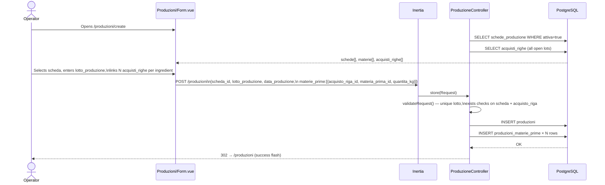

# ARCHITECTURE.md
## Marche International Food S.R.L. — Sistema di Tracciabilità HACCP

---

## 1. Tech Stack

| Layer | Technology | Version | Notes |
|---|---|---|---|
| **Runtime** | PHP | 8.4 | Apache mod_php inside Docker |
| **Framework** | Laravel | 13.x | Full-stack, session-based, Inertia adapter |
| **Frontend** | Vue 3 + Inertia.js | 3.5 / 3.4 | SPA-like navigation without a separate API |
| **UI Library** | PrimeVue + PrimeIcons | 4.5 | Component library; Tailwind CSS 4 for utilities |
| **Build Tool** | Vite | 8.x | Multi-stage Docker build; assets compiled at image build time |
| **Database (prod)** | PostgreSQL | 18 | Declared in `schema.sql`; `ilike` queries confirm PG dialect |
| **Database (dev)** | SQLite | — | Default in `.env.example`; file at `database/database.sqlite` |
| **Auth** | Laravel Session Auth | — | Email + password; `remember_me` cookie; CSRF via Laravel middleware |
| **Roles** | Custom `EnsureAdmin` middleware | — | Two roles: `operator` (default) and `admin` |
| **Containerization** | Docker (multi-stage) | — | Stage 1: Node 22 Alpine (Vite build); Stage 2: PHP 8.4 Apache |
| **Hosting** | Hetzner VPS + Coolify | — | Coolify manages container lifecycle, SSL, and reverse proxy |
| **Queue** | Laravel Queue (database driver) | — | Background jobs stored in `jobs` table; worker runs via `queue:listen` in dev |
| **Cache** | Database driver | — | `cache` table; no Redis in production by default |
| **Session** | Database driver | — | `sessions` table; 120-minute lifetime |

---

## 2. High-Level Architecture



---

## 3. Directory Layout

```
marche-food/
├── app/
│   ├── Http/
│   │   ├── Controllers/
│   │   │   ├── Auth/
│   │   │   │   ├── LoginController.php             # Session login/logout
│   │   │   │   ├── ForgotPasswordController.php    # Send password reset email
│   │   │   │   └── ResetPasswordController.php     # Reset password via token
│   │   │   ├── AcquistoController.php         # Screen 1 — purchase documents (+ export)
│   │   │   ├── VenditaController.php          # Screen 1 — sales documents (+ export)
│   │   │   ├── BollaResoController.php        # Screen 1 — return notes
│   │   │   ├── NotaCreditoController.php      # Screen 1 — credit notes
│   │   │   ├── ImballaggioController.php      # Screen 2 — packaging lots
│   │   │   ├── SchedaProduzioneController.php # Screen 3 — HACCP production sheets
│   │   │   ├── ProduzioneController.php       # Screen 3 — production runs (+ export)
│   │   │   ├── FlussoProduzioneController.php # Screen 3 — workflow step config (admin)
│   │   │   ├── TracciabilitaController.php    # Cross-cutting lot search (forward+reverse+sales)
│   │   │   ├── RecallController.php           # Recall report — lots by supplier/product/date
│   │   │   ├── ReportController.php           # HACCP PDF download per production run
│   │   │   ├── DashboardController.php        # KPIs + expiry alerts
│   │   │   ├── ImportController.php           # CSV bulk import (acquisti + vendite)
│   │   │   ├── FornitoreController.php        # Supplier registry (anagrafica)
│   │   │   ├── ClienteController.php          # Customer registry
│   │   │   ├── ProdottoController.php         # Finished product catalogue
│   │   │   ├── MateriaPrimaController.php     # Raw material catalogue
│   │   │   ├── DestinazioneIngredientiController.php # Allowed ingredient→product mappings
│   │   │   ├── UtenteController.php           # User management (admin only)
│   │   │   └── ProfileController.php          # Self-service password change
│   │   └── Middleware/
│   │       ├── EnsureAdmin.php                # role === 'admin' gate
│   │       └── HandleInertiaRequests.php      # Shares auth user to all Inertia pages
│   ├── Models/                                # 24 Eloquent models (see DATABASE.md)
│   ├── Mail/
│   │   └── AlertScadenzeMail.php              # Mailable: daily expiry alert digest to admin
│   ├── Console/
│   │   └── Commands/
│   │       ├── InviaAlertScadenze.php         # Artisan: haccp:alert-scadenze (runs daily 07:00)
│   │       └── BackupDatabase.php             # Artisan: db:backup — pg_dump + 14-day retention
│   ├── Concerns/
│   │   └── Auditable.php                      # Trait: auto-populates created_by/updated_by on model events
│   └── Providers/
│       └── AppServiceProvider.php
├── database/
│   ├── migrations/                            # 30 migration files (chronological)
│   ├── seeders/                               # Dev-only seed data
│   └── database.sqlite                        # Dev database (git-ignored in prod)
├── resources/
│   ├── js/
│   │   ├── Layouts/
│   │   │   └── AppLayout.vue                  # Shared shell: sidebar nav + header
│   │   └── Pages/                             # One subfolder per domain module
│   │       ├── Auth/Login.vue
│   │       ├── Auth/ForgotPassword.vue        # Request password reset email
│   │       ├── Auth/ResetPassword.vue         # Set new password via token
│   │       ├── Dashboard.vue
│   │       ├── Acquisti/{Index,Form,Print}.vue
│   │       ├── Vendite/{Index,Form}.vue
│   │       ├── BolleReso/{Index,Form}.vue
│   │       ├── NoteCredito/{Index,Form}.vue
│   │       ├── Imballaggi/{Index,FormPrimario,FormDetergente}.vue
│   │       ├── Schede/{Index,Form,Print}.vue
│   │       ├── Produzioni/{Index,Form,Print}.vue   # Index has CSV export + PDF per-row button
│   │       ├── Tracciabilita.vue
│   │       ├── Recall/Index.vue               # Recall report — cross-lot impact search
│   │       ├── Fornitori/{Index,Form}.vue
│   │       ├── Clienti/{Index,Form}.vue
│   │       ├── Prodotti/{Index,Form}.vue
│   │       ├── MateriePrime/{Index,Form}.vue
│   │       ├── DestinazioneIngredienti/Index.vue
│   │       ├── Flussi/Index.vue
│   │       ├── Import/Index.vue
│   │       ├── Utenti/Index.vue
│   │       └── Profilo.vue
│   ├── css/app.css                            # Tailwind entry point
│   └── views/
│       ├── app.blade.php                      # Single Blade template (Inertia root)
│       ├── errors/403.blade.php
│       ├── emails/alert_scadenze.blade.php    # HTML email: daily expiry alert
│       └── pdf/produzione.blade.php           # Blade PDF template (dompdf) for HACCP report
├── routes/
│   ├── web.php                                # All routes (no api.php used)
│   └── console.php                            # Scheduler: haccp:alert-scadenze @ 07:00, db:backup @ 03:00
├── docker/
│   └── start.sh                               # Entrypoint: artisan migrate → scheduler loop (bg) → apache2-foreground
├── public/
│   └── build/                                 # Vite output (baked into image at build time)
├── schema.sql                                 # Canonical PostgreSQL DDL (source of truth)
├── Dockerfile                                 # Multi-stage: Node assets → PHP Apache
├── .env.example
└── composer.json
```

---

## 4. Request Flow

### 4a. Initial Page Load (unauthenticated → dashboard)



### 4b. Production Lot Registration (core HACCP flow)



---

## 5. Security Model

| Concern | Mechanism | Detail |
|---|---|---|
| **Authentication** | Laravel Session Auth | Email + bcrypt password. Session stored in `sessions` DB table. CSRF token required on all state-changing requests (enforced by Laravel's `VerifyCsrfToken` middleware). |
| **Remember Me** | Signed cookie | `remember_token` column in `users` table; signed by `APP_KEY`. |
| **Authorization — read** | `auth` middleware | All routes except `/login` require a valid session. Unauthenticated requests receive a 302 to `/login`. |
| **Authorization — write/delete** | `admin` middleware (`EnsureAdmin`) | DELETE verbs on all operational records, all schede CRUD, flussi config, user management, and CSV import are behind this middleware. Non-admin users are redirected to `/` with an error flash. |
| **Role escalation** | DB column `users.role` | `operator` (default) or `admin`. Only an admin can create/edit users via `UtenteController`. There is no self-registration endpoint. |
| **CSRF protection** | Laravel default | `VerifyCsrfToken` middleware active on all non-GET routes. Inertia automatically includes the `X-XSRF-TOKEN` header on XHR requests. |
| **Direct file access** | Apache `DocumentRoot` → `public/` | Application code, `.env`, and `storage/` are outside the web root. The Dockerfile explicitly sets `APACHE_DOCUMENT_ROOT=/var/www/html/public`. |
| **Password hashing** | bcrypt | `BCRYPT_ROUNDS=12` (configurable via env). |
| **Session fixation** | `session()->regenerate()` | Called in `LoginController::login()` immediately after `Auth::attempt()` succeeds. |
| **Mass assignment** | Eloquent `$fillable` | All models define explicit `$fillable` arrays. No `$guarded = []` shortcuts observed. |
| **Input validation** | Laravel `Request::validate()` | Every controller write method validates before touching the database. |
| **SQL injection** | Eloquent + Query Builder | All user input passed through parameterized queries. Raw `ilike` searches use `->where('col', 'ilike', $term)` with bound parameters, not string interpolation. |
| **Rate limiting** | `throttle:10,1` / `throttle:5,1` | `POST /login` — 10 attempts/minute. `POST /forgot-password` — 5 attempts/minute. |
| **Password reset** | Laravel built-in token mechanism | `password_reset_tokens` table; 60-minute expiry; HMAC-signed. Token sent via email (SMTP). `POST /reset-password` validates token before allowing new password. |
| **HTTPS enforcement** | `URL::forceScheme('https')` | Enabled in `AppServiceProvider::boot()` when `APP_ENV=production`. All generated URLs are forced to HTTPS. Configure HSTS in Traefik for full coverage. |
| **Audit trail** | `Auditable` trait | All operational models (`Acquisto`, `Vendita`, `Produzione`, `BollaReso`, `NotaCredito`, `LottoImballaggioPrimario`, `LottoDetergente`) auto-populate `created_by` and `updated_by` FK columns referencing `users.id`. |
