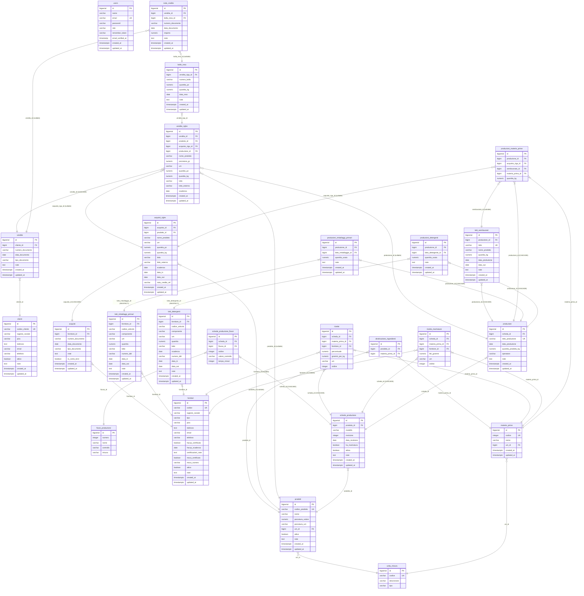

# DATABASE.md
## Marche International Food S.R.L. — Schema di Tracciabilità HACCP

Database: **PostgreSQL 18**
Source of truth DDL: `schema.sql` at project root.

---

## 1. Full ERD

---

## 2. Table Details

### `users`
Application users. Two roles: `admin` and `operator`. No self-registration; only admins can create users. The `remember_token` supports Laravel's "remember me" cookie. `email_verified_at` is present (Laravel default) but not used — verification is not enforced.

### `unita_misura`
Lookup table for units of measure. `tipo` is constrained to `kg`, `lt`, or `n` (numeric/pieces). Referenced by both `prodotti` and `materie_prime`.

### `flussi_produzione`
Master list of production workflow steps (e.g., "Sbrinamento", "Marinatura", "Confezionamento"). Each step optionally carries a CCP (Critical Control Point) description in `controllo` and a measurement label in `misura` (e.g., "Temperatura:", "Tempo:"). These are configured by admin and assembled per-product into `schede_produzione_flussi`.

### `fornitori`
Supplier registry with three types: `alimentare` (food ingredient suppliers), `imballaggio_primario` (primary packaging suppliers), `detergente_secondario` (cleaning product suppliers). The type determines which screens filter on this supplier. HACCP certification (`haccp_certificato`, `haccp_scadenza`) and MOCA certification (`moca_certificato`, `moca_numero`) are tracked for audit compliance.

### `clienti`
Customer registry. Simpler than suppliers — no certification tracking.

### `prodotti`
Finished product catalogue. `codice_prodotto` is the business key. `pezzatura_valore` + `pezzatura_um` define the standard pack size (e.g., 800g). Referenced by purchase lines, sales lines, and production sheets.

### `materie_prime`
Raw ingredients catalogue. `codice` is an integer business key (matches legacy numbering). Referenced by recipes and production ingredient assignments.

### `destinazione_ingredienti`
Allowed mapping between a raw material and the finished products it can enter. This is a many-to-many join with a `UNIQUE(prodotto_id, materia_prima_id)` constraint. It serves as a validation layer to prevent incorrect ingredient assignment, though it is not enforced at the database level on purchase lines — it is a UI-level guide only.

### `acquisti` / `acquisti_righe`
The incoming goods register. Each `acquisto` is a delivery document (DDT, Fattura, Bolla) from a food supplier. `is_conto_terzi` flags documents that belong to a third party (customer-owned goods processed on their behalf) — these are excluded from financial reports and dashboard stock totals. Each `acquisto_riga` is one ingredient lot line. The lot identifier is stored either as `lotto` (internally assigned) or `lotto_esterno` (supplier's lot number) — a `CHECK` constraint enforces mutual exclusivity. `data_in` is the arrival date; `data_out` marks when the lot was fully consumed or returned.

### `vendite` / `vendite_righe`
The outgoing goods register. Document types: `DDT` (transport document), `FI` (invoice), `NC` (credit note). Each sale line carries its lot reference, enabling forward traceability to identify which customers received a specific ingredient lot. `acquisto_riga_id` (nullable) links a sale line directly to the purchase lot that was sold without going through a production run. `produzione_id` (nullable) links a sale line to the production run whose finished product was sold.

### `bolle_reso`
Return notes issued when a customer returns goods. Linked to a specific `vendita_riga` (original sold lot line). Captures returned quantities in both pieces and kg.

### `note_credito`
Credit notes can relate to either a sale document directly (`vendita_id`) or to a return note (`bolla_reso_id`). Both foreign keys are nullable but a `CHECK` constraint (`note_credito_requires_parent`) enforces that at least one must be non-null.

### `lotti_imballaggi_primari`
Incoming lots of primary packaging materials (bags, trays, etc.) from `imballaggio_primario` suppliers. Tracked for MOCA compliance. `data_out` marks when the lot was exhausted.

### `lotti_detergenti`
Incoming lots of cleaning and sanitizing products from `detergente_secondario` suppliers. Has an additional `scadenza` (expiry) field that packaging lots do not.

### `schede_produzione`
HACCP production sheets — the template for a production run. One sheet per product per revision. `UNIQUE(prodotto_id, revisione)` ensures clean versioning. `ha_marinatura` controls whether the marinatura recipe section is displayed. `attiva` soft-gates the scheda from being selected for new productions without deleting historical records.

### `schede_produzione_flussi`
The ordered list of workflow steps for a specific production sheet. Each row links a `scheda` to a `flusso_produzione` step, with optional `valore_controllo` (the recorded measurement value, e.g., "78°C") and `tempo_minuti`.

### `ricette`
The standard ingredient recipe for a production sheet. Each row is one ingredient with its percentage and grams-per-kg of final product. An optional preferred `fornitore_id` can be specified.

### `ricette_marinature`
The marinade recipe for products where `ha_marinatura = TRUE`. Separate from the main recipe; quantities are expressed in `litri_grammi`.

### `produzioni`
Records a single production run. `lotto_produzione` is the system-assigned lot identifier for the batch of finished product — it is globally unique. This is the pivot of the entire HACCP traceability chain.

### `lotti_semilavorati`
Records a semi-finished product (intermediate output) created by a production run. A production run can produce a `lotto_semilavorato` which can then be consumed as an ingredient in a subsequent production run, enabling multi-stage processing chains. `data_out` marks when the semi-finished lot was fully consumed. Linked back to the originating `produzione_id` with `CASCADE ON DELETE`.

### `produzioni_materie_prime`
**The core of HACCP traceability.** Each row links a production run to an ingredient source — either a purchased lot (`acquisto_riga_id`) or an internal semi-finished lot (`semilavorato_id`). Exactly one of the two FK columns must be non-null (enforced by a `CHECK` constraint on PostgreSQL). Records the quantity consumed (`quantita_kg`). This table enables:
- **Forward trace**: Given a purchase lot → which productions used it → which sales received those finished lots.
- **Reverse trace**: Given a production lot → which purchase lots and suppliers contributed ingredients.

### `produzioni_imballaggi_primari`
Junction table linking a production run to the primary packaging lots (MOCA compliance) used during that run. `lotto_imballaggio_id` uses `ON DELETE RESTRICT` to prevent deletion of a packaging lot that has been used in a production. Enables answering: "Which production runs used packaging lot X?"

### `produzioni_detergenti`
Junction table linking a production run to the cleaning/sanitizing product lots used during that session. `lotto_detergente_id` uses `ON DELETE RESTRICT`. Enables full chemical traceability per production batch.

---

## 3. Data Integrity Notes

**Cascading deletes** are used in the following relationships:

| Parent | Child | Behaviour |
|---|---|---|
| `acquisti` | `acquisti_righe` | `ON DELETE CASCADE` — deleting a purchase document removes all its lines |
| `vendite` | `vendite_righe` | `ON DELETE CASCADE` — deleting a sale document removes all its lines |
| `schede_produzione` | `schede_produzione_flussi` | `ON DELETE CASCADE` |
| `schede_produzione` | `ricette` | `ON DELETE CASCADE` |
| `schede_produzione` | `ricette_marinature` | `ON DELETE CASCADE` |
| `produzioni` | `produzioni_materie_prime` | `ON DELETE CASCADE` — deleting a production run removes all its ingredient lot linkages |
| `produzioni` | `produzioni_imballaggi_primari` | `ON DELETE CASCADE` |
| `produzioni` | `produzioni_detergenti` | `ON DELETE CASCADE` |

**Critical constraint — lotto XOR lotto_esterno**: Both `acquisti_righe` and `vendite_righe` carry a `CHECK` constraint (`lotto_xor`) that prevents both `lotto` and `lotto_esterno` from being non-null simultaneously. One must be null.

**Revision uniqueness**: `schede_produzione` has `UNIQUE(prodotto_id, revisione)`, preventing duplicate revisions for the same product.

**Production lot uniqueness**: `produzioni.lotto_produzione` has a `UNIQUE` constraint enforced at both the DB level and in Laravel validation (`Rule::unique(...)->ignore($id)`).

**Destination mapping uniqueness**: `destinazione_ingredienti` has `UNIQUE(prodotto_id, materia_prima_id)`.

**Nullable FK on `acquisti_righe.prodotto_id`**: Purchase lines can reference a `prodotto` record, but this is optional — `nome_prodotto` (free text) is the primary identification field. This supports historical imports where product catalogue records may not exist.

**No stock ledger**: The schema records quantities in and out per lot but does not maintain a running stock balance. Current stock of any lot must be computed by subtracting `produzioni_materie_prime.quantita_kg` (consumed) from `acquisti_righe.quantita_kg` (received). There is no materialized inventory column.

**`produzioni_materie_prime` has no timestamps**: `public $timestamps = false` on the model. Audit trail for production ingredient lines relies on the parent `produzioni.updated_at`.

**`produzioni_materie_prime` XOR source constraint**: On PostgreSQL, a `CHECK` constraint (`source_exactly_one`) enforces that exactly one of `acquisto_riga_id` or `semilavorato_id` is non-null per row. This is also enforced at the application layer in `ProduzioneController::validateRequest()`.

**Audit columns on operational tables**: `acquisti`, `vendite`, `produzioni`, `bolle_reso`, `note_credito`, `lotti_imballaggi_primari`, and `lotti_detergenti` all carry `created_by BIGINT REFERENCES users(id)` and `updated_by BIGINT REFERENCES users(id)`, auto-populated by the `Auditable` trait via Eloquent model events.

**`note_credito_requires_parent` CHECK constraint**: Ensures `vendita_id IS NOT NULL OR bolla_reso_id IS NOT NULL` — an orphaned credit note with both FK columns null is rejected at the database level.
