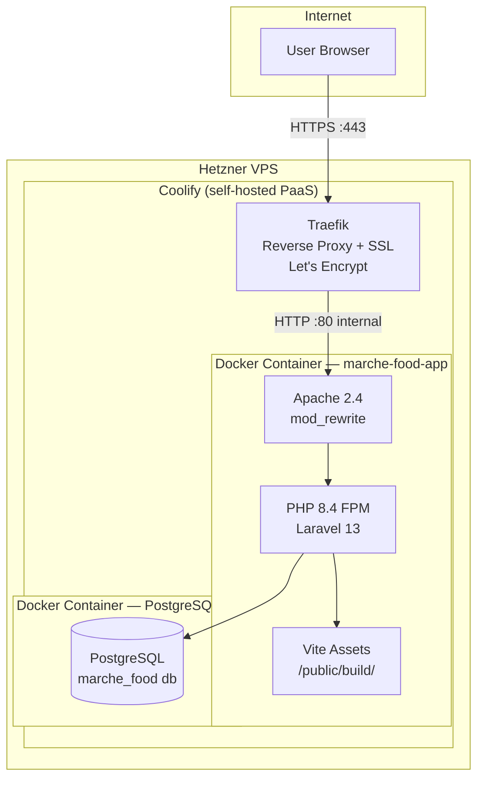

# DEPLOY.md
## Marche International Food S.R.L. — Deployment Reference

---

## 1. Infrastructure Overview



### Hosting
- **Provider**: Hetzner Cloud (VPS)
- **PaaS**: Coolify manages container builds, deployments, SSL certificates (Let's Encrypt via Traefik), and environment variable injection
- **Containers**: Two containers — the PHP/Apache app and PostgreSQL. Both run inside Coolify's Docker network; the DB is not publicly exposed

### Build Process
The Dockerfile uses a **multi-stage build**:

1. **Stage 1 (`assets`)** — Node 22 Alpine: runs `npm ci && npm run build` to compile Vue components and Tailwind CSS. Output goes to `public/build/`.
2. **Stage 2 (final)** — PHP 8.4 Apache: installs Composer dependencies (`--no-dev --optimize-autoloader`), copies the compiled Vite assets from Stage 1, sets file permissions on `storage/` and `bootstrap/cache/`, configures Apache `DocumentRoot` to `public/`.

The final image contains no Node.js runtime — assets are baked in at build time.

### Startup Sequence
The container entrypoint is `docker/start.sh`:

```bash
php artisan migrate --force    # Run pending migrations; exits 1 on failure
apache2-foreground              # Start Apache in foreground
```

Migrations run automatically on every container start. If a migration fails, the container exits with code 1 and Coolify will surface the error in its logs.

---

## 2. Environment Variables

The minimal set required for a working production deployment. Remove all unused skeleton variables from `.env`.

```dotenv
# ── Application ─────────────────────────────────────────────────────────────
APP_NAME="Marche Food"
APP_ENV=production
APP_KEY=base64:GENERATED_BY_ARTISAN_KEY_GENERATE
APP_DEBUG=false
APP_URL=https://your-domain.example.com

# ── Database ─────────────────────────────────────────────────────────────────
DB_CONNECTION=pgsql
DB_HOST=coolify-postgres-internal-hostname   # Coolify internal service name
DB_PORT=5432
DB_DATABASE=marche_food
DB_USERNAME=marche_food_user
DB_PASSWORD=STRONG_RANDOM_PASSWORD

# ── Session & Cache (database driver — no Redis needed) ───────────────────
SESSION_DRIVER=database
SESSION_LIFETIME=120
SESSION_ENCRYPT=true
CACHE_STORE=database
QUEUE_CONNECTION=database

# ── Logging ──────────────────────────────────────────────────────────────────
LOG_CHANNEL=stack
LOG_STACK=single
LOG_LEVEL=error

# ── Security ─────────────────────────────────────────────────────────────────
BCRYPT_ROUNDS=12
```

**Variables you do NOT need in production** (safe to omit):
`MAIL_*`, `REDIS_*`, `AWS_*`, `BROADCAST_CONNECTION`, `MEMCACHED_HOST`, `VITE_APP_NAME`, `APP_LOCALE`, `APP_FALLBACK_LOCALE`, `APP_FAKER_LOCALE`, `APP_MAINTENANCE_DRIVER`.

---

## 3. First-Time Setup

```bash
# 1. On the server, generate the application key before first deploy
php artisan key:generate

# 2. Coolify handles the build and deploy via Dockerfile.
#    On first container start, migrations run automatically.

# 3. Create the initial admin user (run inside the container)
php artisan tinker
>>> App\Models\User::create([
...     'name' => 'Admin',
...     'email' => 'admin@example.com',
...     'password' => bcrypt('SECURE_PASSWORD'),
...     'role' => 'admin',
... ]);
```

---

## 4. Deployment Workflow

Coolify watches the configured Git branch (typically `main`). On push:

1. Coolify pulls the new commit
2. Docker builds the multi-stage image (Node assets → PHP Apache)
3. Coolify stops the old container and starts the new one
4. `start.sh` runs `artisan migrate --force` before Apache starts
5. If migration fails, container exits; previous container does **not** auto-restart (Coolify behavior — verify rollback strategy in Coolify settings)

**Zero-downtime caveat**: There is no rolling deploy or blue-green setup. Each deploy has a brief downtime window during the container swap (~5–15 seconds for a warm Docker build).

---

## 5. Background Jobs / Cron

### Queue Worker
The database queue driver is configured (`QUEUE_CONNECTION=database`). In development, `queue:listen` runs as part of `composer dev`. **In production, no queue worker is started** — `start.sh` only starts Apache. The `jobs` table exists but no jobs are dispatched by current application code. A worker process would need to be added to `start.sh` or as a separate Coolify process if background jobs are added in future.

### Scheduled Tasks
There are no scheduled tasks defined. `routes/console.php` is empty. `php artisan schedule:run` is not called from `start.sh` or any cron.

### Potential Future Cron Candidates
Based on the domain, the following would be natural additions:

| Task | Suggested Frequency | Purpose |
|---|---|---|
| Expiry alert email digest | Daily at 07:00 | Notify admin of lots expiring in ≤ 30 days |
| HACCP certificate expiry check | Weekly | Alert on `fornitori.haccp_scadenza` within 60 days |
| Database backup | Daily | Dump PostgreSQL and store off-site |

---

## 6. Storage & Backups

- **Uploaded files**: CSV imports are read from PHP's temp directory and never persisted. No file storage volume is needed.
- **Logs**: Set `LOG_CHANNEL=stderr` in Coolify's environment variable panel. Logs are then captured by Docker and visible in Coolify's container log viewer, surviving container rebuilds. The default `stack` driver writes to `storage/logs/laravel.log` which is lost on rebuild — do not rely on it in production.
- **Database backups**: Not automated. Hetzner snapshots or `pg_dump` cron jobs must be configured manually outside Coolify.

---

## 7. Accessing Logs

```bash
# Via Coolify UI: Deployments → Container Logs

# Via Docker CLI on the VPS:
docker logs <container_id> --tail 100 -f

# Laravel application log (inside container):
docker exec <container_id> tail -f /var/www/html/storage/logs/laravel.log
```
