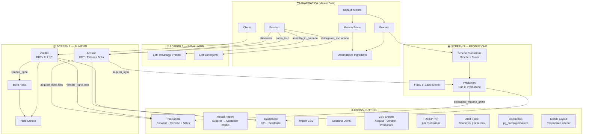

# MODULES.md
## Marche International Food S.R.L. — Business Logic Breakdown

---

## 1. Module Map



---

## 2. Module Descriptions

### Anagrafica (Master Data)

The anagrafica modules are the configuration layer. Operators can read all registries; only admins can mutate them. Mastering this data correctly is a prerequisite for all operational modules to function.

**Fornitori** are typed. The `tipo` field determines which operational screen they appear in:
- `alimentare` → available in Acquisti forms (standard ingredient purchases)
- `conto_terzi` → available in Acquisti forms; marks third-party processing suppliers (acquisti with `is_conto_terzi = TRUE`)
- `imballaggio_primario` → available in Lotti Imballaggi Primari forms
- `detergente_secondario` → available in Lotti Detergenti forms

This means adding a new supplier without setting the correct `tipo` will make them invisible in the relevant form.

**Destinazione Ingredienti** is a matrix defining which raw materials (`materie_prime`) are permitted ingredients for each finished product (`prodotti`). It is informational in the UI — it guides operators when recording production runs — but the database does not enforce it during production creation. A production can use an ingredient that is not in the mapping without triggering a constraint error.

**Unità di Misura** has a `tipo` enum (`kg`, `lt`, `n`) but this distinction is not enforced downstream — no calculation logic uses it to convert or validate quantities. It is display-only.

---

### Screen 1 — Alimenti (Food Documents)

The food document module covers the full purchase-to-sale cycle for ingredients and finished products.

**Acquisti** register incoming food deliveries. Each document has a header (supplier, document number, date, type) and one or more `acquisti_righe`. Each line represents one ingredient lot. The lot identifier (`lotto` or `lotto_esterno`) is the key field — it links purchases to production runs in the HACCP chain. `data_out` on a riga signals the lot is closed (fully consumed or returned); the dashboard uses `data_out IS NULL` to identify open lots.

> **Edit safety**: The controller uses a diff-based sync strategy when saving an acquisto. Lines present in both the database and the submission are updated in place (IDs preserved). Lines removed from the submission are checked for downstream FK references in `produzioni_materie_prime` before deletion — if references exist, the save is rejected with a clear Italian error message. Lines already used in a production can still be edited (quantity, lot number, etc.); only deletion of such lines is blocked.

**Vendite** register outgoing sales. Document types:
- `DDT` — transport document, no financial value
- `FI` — fiscal invoice
- `NC` — credit note (can also be recorded separately in the `note_credito` module)

Each `vendita_riga` carries the lot number of the finished product sold, enabling forward traceability from ingredient lots → production lots → sale lots → customers.

**Bolle Reso** record customer returns. They reference a specific `vendita_riga` (the original lot sold). Returned quantities are recorded but there is no mechanism to automatically re-open or reverse the lot in `acquisti_righe`.

**Note Credito** are financial adjustments. They can reference either a `vendita` directly or a `bolla_reso`. A `CHECK` constraint at the database level (`note_credito_requires_parent`) ensures at least one FK is always populated.

---

### Screen 2 — Imballaggi (Packaging Lots)

A register for non-food inputs linked to the HACCP production chain. Packaging and detergent lots are linked to production runs via `produzioni_imballaggi_primari` and `produzioni_detergenti` junction tables. The system can now answer: "Which production runs used packaging lot X?" and "Which cleaning product was used during batch Y?"

**Lotti Imballaggi Primari** — materials in direct contact with food (e.g., vacuum bags, trays). Supplier must be type `imballaggio_primario`.

**Lotti Detergenti** — cleaning and sanitizing products. Supplier must be type `detergente_secondario`. Has an additional `scadenza` field for chemical expiry.

The index view is a single tabbed page (`Imballaggi/Index.vue`) with two independent paginated tables and two independent search inputs (`search_p`, `search_d`).

---

### Screen 3 — Produzione (Production)

The most complex module and the backbone of HACCP compliance.

**Flussi di Lavorazione** are the reusable workflow step definitions (e.g., "Scongelamento", "Cottura a vapore", "Confezionamento"). Each step can optionally define a CCP (`controllo`) and a measurement unit label (`misura`). These are master-data configured by admins and are not changed per-production.

**Schede Produzione** are HACCP production templates. One scheda exists per product-revision combination. A scheda contains:
1. An ordered list of workflow steps (`schede_produzione_flussi`), each with an optional recorded `valore_controllo` and `tempo_minuti`.
2. A standard recipe (`ricette`): the list of raw materials with percentages and grams-per-kg.
3. Optionally, a marinade recipe (`ricette_marinature`) if `ha_marinatura = TRUE`.

When a scheda is created with `attiva = true`, the controller automatically sets `attiva = false` on all previous revisions for the same `prodotto_id`. The `UNIQUE(prodotto_id, revisione)` constraint enforces clean versioning. At most one revision per product is active at any time.

**Produzioni** are individual production run records. Creating a production is the critical HACCP act: the operator selects an active scheda, assigns a unique `lotto_produzione`, and — most importantly — links each ingredient in the recipe to a specific `acquisto_riga` (i.e., a specific physical lot of that ingredient).

The `produzioni_materie_prime` table is the join that makes full traceability possible:
```
acquisto_riga (lot of ingredient X from supplier Y on date Z)
    → produzione_materia_prima (used qty_kg)
        → produzione (production run, lotto_produzione)
            → vendita_riga (sold as finished product to customer W)
```

The backend validates that all submitted `materia_prima_id` values are present in the scheda's recipe (`ricette` + `ricette_marinature`). Submitting an ingredient not in the recipe returns a 422 with the names of the invalid ingredients. Validation is skipped when the scheda has no defined recipe, allowing flexible production runs for schede without rigid ingredient lists.

---

### Dashboard

The dashboard (`DashboardController`) aggregates six KPI counters (total and current-month counts for acquisti, vendite, produzioni) and two expiry alerts:
- **Lotti in scadenza**: open acquisto_righe expiring within the next 30 days.
- **Lotti scaduti**: open acquisto_righe with a past `scadenza`.

The last 5 acquisti and last 5 produzioni are shown as quick-access recent activity panels. KPI counts are cached for 5 minutes (`Cache::remember`). Safety-critical expiry counts use a separate 60-second TTL to balance freshness with performance.

---

### Tracciabilità (Lot Search)

A unified cross-domain search. Given a query string, the controller performs two parallel searches:

1. **Forward trace** (ingredient lot → production): searches `acquisti_righe.lotto`, `lotto_esterno`, and `nome_prodotto`. For each match, eager-loads the chain `acquisto → fornitore` and `produzioni_materie_prime → produzione → scheda → prodotto`.

2. **Reverse trace** (production lot → ingredients): searches `produzioni.lotto_produzione` and the product name. For each match, eager-loads `scheda → prodotto` and `materiePrime → materiaPrima + acquistoRiga → acquisto → fornitore`.

Results are limited to 50 rows (forward) and 20 rows (reverse/production) and 20 rows (sales). When a limit is hit, the UI displays a truncation warning with the actual total count. A third search leg queries `vendite_righe` by lot number and product name, linking production lots forward to sale documents and customers — completing the full HACCP chain from ingredient lot → production → customer.

---

### Import CSV

An admin-only bulk data entry tool for migrating historical records. Accepts semicolon-delimited CSV files for acquisti and vendite. The import groups rows by `fornitore_codice|numero_documento|data_documento` (acquisti) or `cliente_codice|numero_documento|data_documento` (vendite) to reconstruct document headers from flat CSV rows.

**Key constraint**: Supplier and customer lookup is by `codice` / `codice_cliente`. If a supplier code in the CSV does not match an existing `fornitori.codice`, that document group is skipped and an error is appended to the response message. The entire import is wrapped in a `DB::transaction()` — if any error occurs, all rows are rolled back and the database is left unchanged.

---

### Gestione Utenti

Admin-only user management. No self-registration. Admin can:
- Create users with either role
- Edit name, email, role
- Force-reset any user's password
- Delete any user except themselves

All operational records (`acquisti`, `vendite`, `produzioni`, `bolle_reso`, `note_credito`, `lotti_imballaggi_primari`, `lotti_detergenti`) carry `created_by` and `updated_by` FK columns referencing `users.id`, auto-populated by the `Auditable` trait on model creation and update events.

---

### Password Reset (Self-Service)

Users can reset their own password without admin involvement:

1. User clicks "Password dimenticata?" on the login screen → `/forgot-password`
2. `ForgotPasswordController::send()` calls `Password::sendResetLink()`, which inserts a hashed token into `password_reset_tokens` and sends an email.
3. User clicks the link in the email → `/reset-password/{token}`
4. `ResetPasswordController::reset()` validates the token (60-minute expiry) and calls `Password::reset()` to update the password and invalidate the token.

Rate-limited: `POST /forgot-password` is throttled at 5 requests/minute to prevent email flooding. The token is single-use and expires after 60 minutes (Laravel default).

---

### CSV Exports

Each of the three main operational list views has an "Esporta CSV" button that triggers a streaming download:

| Route | Controller | Contents |
|---|---|---|
| `GET /acquisti/export` | `AcquistoController::export()` | All acquisto_righe with document header + lot fields |
| `GET /vendite/export` | `VenditaController::export()` | All vendita_righe with document header + lot fields |
| `GET /produzioni/export` | `ProduzioneController::export()` | All production runs with scheda, product, operator |

Files are UTF-8 with BOM (for Excel compatibility), semicolon-delimited. The download uses `response()->streamDownload()` — no temp file is written to disk. Filename format: `acquisti_YYYYMMDD_HHmmss.csv`.

---

### HACCP PDF Reports

Each production run has a PDF download button in the Produzioni index (`pi-file-pdf` icon). The route `GET /produzioni/{id}/pdf` is handled by `ReportController::produzionePdf()`:

1. Loads the production with all relationships (scheda, product, workflow steps, raw materials with supplier lots, packaging lots, detergent lots).
2. Renders `resources/views/pdf/produzione.blade.php` via dompdf (`barryvdh/laravel-dompdf v3.1`).
3. Returns the PDF as a file download (`Content-Disposition: attachment`). Filename: `lavorazione_{lotto_produzione}.pdf`.

The PDF includes: company header, production lot + date, product name, scheda code, workflow steps with CCP measurements, ingredient table (lot, supplier, quantity), packaging and detergent tables, operator signature field.

---

### Recall Report

`GET /recall` (sidebar: "Rapporto Recall") handled by `RecallController::index()`.

Given a production lot number, the recall report answers: "Which customers received this finished product lot?"

The controller searches `produzioni` by `lotto_produzione` (partial match), then finds all `vendite_righe` whose `lotto` or `lotto_esterno` matches any of the found production lots. Results are shown in two sections: (1) matching production runs, (2) customer sales rows that need to be notified.

**Scope**: The search starts from a production lot. For ingredient-based recall (e.g., "supplier X recalled ingredient Y"), use the Tracciabilità module first to find which production lots consumed that ingredient, then bring those lots into the Recall Report. A combined single-query flow from ingredient → customer is a planned enhancement.

The report includes a warning banner listing the number of customers to contact and a reminder to notify the health authority (ASL/RASFF).

---

### Expiry Alert Emails

The Artisan command `haccp:alert-scadenze` (class `InviaAlertScadenze`) runs daily at 07:00 via the Laravel scheduler:

1. Queries open `acquisti_righe` (`data_out IS NULL`) to build two lot lists:
   - **Expired** (`scadenza < today`)
   - **Expiring within 30 days** (`scadenza BETWEEN today AND today+30`)
2. Queries active suppliers (`attivo = true`) with `haccp_certificato = true` whose `haccp_scadenza` falls within the next 60 days.
3. If any of the three lists are non-empty, sends `AlertScadenzeMail` to **all users with `role = admin`** (queried from the `users` table).
4. The mail (`resources/views/emails/alert_scadenze.blade.php`) renders three sections:
   - 🔴 Lotti già scaduti
   - 🟡 Lotti in scadenza nei prossimi 30 giorni
   - 📋 Certificati HACCP fornitori in scadenza (60 giorni)

If all three lists are empty, no email is sent. If `MAIL_*` env vars are not configured, the command exits with an error logged but does not crash the container.

---

### DB Backup (Automated)

The Artisan command `db:backup` (class `BackupDatabase`) runs daily at 03:00:

1. Calls `pg_dump` (available via `postgresql-client` installed in the Dockerfile) against the configured `DB_*` env vars.
2. Saves the dump to `storage/app/backups/backup_YYYYMMDD_HHmmss.sql.gz` (hardcoded path inside the container).
3. Prunes backup files older than 14 days from the same directory.

**Durability note**: The backup path is inside the Docker container. On a container rebuild the files are lost. To make backups durable, mount a Hetzner Volume at the `BACKUP_PATH` — the command uses whatever path the env var points to.

---

### Mobile Layout

`AppLayout.vue` is fully responsive at the 768px breakpoint:

- **Hamburger button** (top-left of the topbar) appears on mobile; hidden on desktop.
- **Sidebar** becomes fixed-position, off-screen by default (`transform: translateX(-100%)`). Clicking the hamburger adds class `sidebar-open` which slides it in (`transform: translateX(0)`).
- **Overlay** — a dark semi-transparent div covers the main content while the sidebar is open. Clicking the overlay closes the sidebar.
- **Auto-close** — any nav link click inside the sidebar fires `sidebarOpen = false`, closing the sidebar automatically after navigation.
- All list pages (DataTables) use `overflow-x: auto` so wide tables scroll horizontally rather than breaking the layout on narrow screens.

---

## 3. Module Interaction Summary

| Module | Reads From | Writes To | Blocks If Missing |
|---|---|---|---|
| Acquisti | Fornitori (alimentare, conto_terzi) | `acquisti`, `acquisti_righe` | Produzioni cannot link lots |
| Vendite | Clienti | `vendite`, `vendite_righe` | — |
| Bolle Reso | Vendite righe | `bolle_reso` | Note Credito (via bolla) |
| Note Credito | Vendite, Bolle Reso | `note_credito` | — |
| Imballaggi | Fornitori (packaging/detergent) | `lotti_imballaggi_primari`, `lotti_detergenti` | — |
| Schede Produzione | Prodotti, Materie Prime, Flussi | `schede_produzione` + children | Produzioni cannot be created |
| Produzioni | Schede, Acquisti Righe, Lotti Imballaggi, Lotti Detergenti | `produzioni`, `produzioni_materie_prime`, `produzioni_imballaggi_primari`, `produzioni_detergenti` | Tracciabilità has no data |
| Tracciabilità | Acquisti Righe, Produzioni, Vendite Righe | (read-only) | — |
| Recall Report | Acquisti Righe, Produzioni, Vendite Righe, Clienti | (read-only) | — |
| HACCP PDF | Produzioni + all relationships | (read-only, streams to browser) | — |
| CSV Exports | Acquisti Righe / Vendite Righe / Produzioni | (read-only, streams to browser) | — |
| Expiry Alert Email | Acquisti Righe | Sends email | Requires MAIL_* env vars |
| DB Backup | PostgreSQL (via pg_dump) | `storage/backups/*.sql.gz` | Requires postgresql-client in image |
| Dashboard | Acquisti, Vendite, Produzioni | (read-only) | — |
| Import | Fornitori, Clienti | `acquisti`, `acquisti_righe`, `vendite`, `vendite_righe` | — |
| Password Reset | `users`, `password_reset_tokens` | `password_reset_tokens`, `users.password` | Requires MAIL_* env vars |

---

## Modules added 2026-07-01

| Module | Route(s) | Purpose |
|---|---|---|
| **Report Gestionale** | `/report`, `/report/csv`, `/report/pdf` | Date-range management report: purchase/sales/production volumes (conto-terzi excluded), per-supplier / per-customer, expiry list. `ReportService`. |
| **Giacenze Magazzino** | `/magazzino`, `/magazzino/export` | Stock report: purchase-lot + semilavorato balances (received − consumed − sold). `InventoryService`. |
| **Ricerca Globale** | `/cerca` | Cross-entity search (fornitori, clienti, prodotti, materie prime, lotti). `SearchService`. Topbar box. |
| **Log Attività (Audit)** | `/audit` (admin) | "Who created/modified what" across the 7 audited tables. `AuditService`. |
| **Recall (stateful)** | `/recall`, `POST /recall`, `/recall/{id}`, `PUT /recall/{id}/stato`, `POST /recall/{id}/notifiche/{n}` | Open a recall → auto-populate affected customers → mark notified → close. `recalls` + `recall_notifiche`. |
| **Notifiche in-app** | `/notifiche`, `POST /notifiche/{n}/dismiss`, `POST /notifiche/dismiss-all` | DB-driven alerts center + topbar dropdown bell with per-user dismiss. `NotificationService`, command `notifiche:genera` (hourly). |
| **Kiosk Produzione** | `/produzioni/kiosk`, `/produzioni/kiosk/lookup` | Tablet full-screen operator entry: scan/enter lot → keypad kg → submit via `ProduzioneController@store`. `KioskController`; QR via `public/vendor/html5-qrcode.min.js`. |
| **Etichette lotto (QR)** | `/produzioni/{id}/etichetta` | Printable lot labels; QR opens `/tracciabilita?q=<lotto>`. `public/vendor/qrcode-generator.js`. |
| **DDT/Fattura PDF** | `/acquisti/{id}/pdf`, `/vendite/{id}/pdf` | dompdf documents for purchases/sales. |
| **2FA (admin)** | `/profilo/2fa/*`, `/2fa/challenge` | TOTP two-factor (RFC 6238) with recovery codes + two-step login. Admin-only. `TotpService`, `TwoFactorController`. |
| **Estrazione AI certificati** | `POST /fornitori/estrai-certificato` (admin) | Claude Vision extracts `haccp_scadenza` + `moca_numero` from an uploaded certificate. `CertificateExtractionService`. |
| **Optimistic locking** | on `PUT /acquisti|vendite|produzioni/{id}` | `updated_at` conflict guard (`Controller::assertNotStale`). |

## Modules added 2026-07-06

| Module | Route(s) | Purpose |
|---|---|---|
| **Cestino (soft-delete)** | `/cestino`, `POST /cestino/{tipo}/{id}/restore`, `DELETE /cestino/{tipo}/{id}` (admin) | Recover or permanently remove soft-deleted operational documents (acquisti, vendite, produzioni, bolle reso, note credito, imballaggi, detergenti). `CestinoController`. Delete now **soft-deletes** (recoverable) instead of a hard, irreversible DELETE. |
| **Etichette lotto acquisto/vendita (QR)** | `/acquisti/{id}/etichette`, `/vendite/{id}/etichette` | Printable QR labels per received/sold lot; each QR opens `/tracciabilita?q=<lotto>`. Extends the existing produzione label to purchases/sales. `ReportController`; `labels/lotti.blade.php`. |
| **Allergeni (Reg. UE 1169/2011)** | on `/materie-prime` (CRUD), surfaced in `/tracciabilita`, the produzione QR label, and the produzione PDF | The 14 EU allergens per raw material (*contiene* + *può contenere / tracce*), **propagated** (union, recursive through semilavorati) to each production lot. `AllergenService`. |

### Soft-delete & restore (data safety)

`Acquisto`, `Vendita`, `Produzione`, `BollaReso`, `NotaCredito`, `LottoImballaggioPrimario`, `LottoDetergente` use Laravel's `SoftDeletes`. Normal lists/edits automatically hide trashed rows (global scope). Admins see trashed documents under **Utilità → Cestino** and can restore them (they reappear everywhere, including inventory/traceability) or delete them permanently. Deleting is **guarded**: a purchase whose lot is consumed by an active production or sold, a production whose semilavorato is consumed downstream or whose lot is sold, a packaging/detergent lot used in an active production, a sale with return slips, or a return slip with a credit note — cannot be trashed until the referencing document is removed first. Trashing a production releases its consumption back to lot balances.

### Allergen tracking (FIC)

Each materia prima declares which of the 14 EU allergens it **contains** and which it **may contain** (cross-contact / tracce), stored as JSON. `AllergenService::forProduzione()` computes a finished lot's declaration as the union of its ingredients' allergens, recursing into any semi-finished ingredient's source production (an allergen that is a declared "contains" is dropped from "may contain"). The result is shown as chips in the materie-prime list and traceability view, and printed on the production QR label and HACCP PDF.
