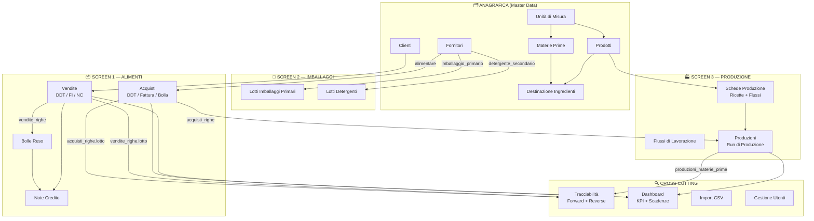

# MODULES.md
## Marche International Food S.R.L. — Business Logic Breakdown

---

## 1. Module Map



---

## 2. Module Descriptions

### Anagrafica (Master Data)

The anagrafica modules are the configuration layer. Operators can read all registries; only admins can mutate them. Mastering this data correctly is a prerequisite for all operational modules to function.

**Fornitori** are typed. The `tipo` field determines which operational screen they appear in:
- `alimentare` → available in Acquisti forms
- `imballaggio_primario` → available in Lotti Imballaggi Primari forms
- `detergente_secondario` → available in Lotti Detergenti forms

This means adding a new supplier without setting the correct `tipo` will make them invisible in the relevant form.

**Destinazione Ingredienti** is a matrix defining which raw materials (`materie_prime`) are permitted ingredients for each finished product (`prodotti`). It is informational in the UI — it guides operators when recording production runs — but the database does not enforce it during production creation. A production can use an ingredient that is not in the mapping without triggering a constraint error.

**Unità di Misura** has a `tipo` enum (`kg`, `lt`, `n`) but this distinction is not enforced downstream — no calculation logic uses it to convert or validate quantities. It is display-only.

---

### Screen 1 — Alimenti (Food Documents)

The food document module covers the full purchase-to-sale cycle for ingredients and finished products.

**Acquisti** register incoming food deliveries. Each document has a header (supplier, document number, date, type) and one or more `acquisti_righe`. Each line represents one ingredient lot. The lot identifier (`lotto` or `lotto_esterno`) is the key field — it links purchases to production runs in the HACCP chain. `data_out` on a riga signals the lot is closed (fully consumed or returned); the dashboard uses `data_out IS NULL` to identify open lots.

> **Important operational constraint**: When editing an acquisto, the controller performs a full delete-and-recreate of all `acquisti_righe`. If any `acquisto_riga` has been linked to a `produzione` via `produzioni_materie_prime`, the DELETE will fail with a FK violation (no `ON DELETE CASCADE` from `acquisti_righe` to `produzioni_materie_prime`). This means **once a purchase line has been used in a production run, the parent acquisto cannot be updated via the edit form**. This is not surfaced as a clear error message to the user (see GAPS.md).

**Vendite** register outgoing sales. Document types:
- `DDT` — transport document, no financial value
- `FI` — fiscal invoice
- `NC` — credit note (can also be recorded separately in the `note_credito` module)

Each `vendita_riga` carries the lot number of the finished product sold, enabling forward traceability from ingredient lots → production lots → sale lots → customers.

**Bolle Reso** record customer returns. They reference a specific `vendita_riga` (the original lot sold). Returned quantities are recorded but there is no mechanism to automatically re-open or reverse the lot in `acquisti_righe`.

**Note Credito** are financial adjustments. They can reference either a `vendita` directly or a `bolla_reso`. There is no validation enforcing that at least one of the two foreign keys is populated — both can be null, creating orphaned credit notes.

---

### Screen 2 — Imballaggi (Packaging Lots)

A self-contained register for non-food inputs. Unlike food purchases, packaging and detergent lots are **not linked to production runs** in the current schema. They are tracked for regulatory compliance (MOCA for packaging; chemical safety for detergents) but there is no `produzioni_imballaggi` junction table. This means the system records that a packaging lot existed but cannot trace which production run used it.

**Lotti Imballaggi Primari** — materials in direct contact with food (e.g., vacuum bags, trays). Supplier must be type `imballaggio_primario`.

**Lotti Detergenti** — cleaning and sanitizing products. Supplier must be type `detergente_secondario`. Has an additional `scadenza` field for chemical expiry.

The index view is a single tabbed page (`Imballaggi/Index.vue`) with two independent paginated tables and two independent search inputs (`search_p`, `search_d`).

---

### Screen 3 — Produzione (Production)

The most complex module and the backbone of HACCP compliance.

**Flussi di Lavorazione** are the reusable workflow step definitions (e.g., "Scongelamento", "Cottura a vapore", "Confezionamento"). Each step can optionally define a CCP (`controllo`) and a measurement unit label (`misura`). These are master-data configured by admins and are not changed per-production.

**Schede Produzione** are HACCP production templates. One scheda exists per product-revision combination. A scheda contains:
1. An ordered list of workflow steps (`schede_produzione_flussi`), each with an optional recorded `valore_controllo` and `tempo_minuti`.
2. A standard recipe (`ricette`): the list of raw materials with percentages and grams-per-kg.
3. Optionally, a marinade recipe (`ricette_marinature`) if `ha_marinatura = TRUE`.

When a scheda is updated (new revision), the old scheda should be deactivated (`attiva = false`) and a new one created. The `UNIQUE(prodotto_id, revisione)` constraint enforces clean versioning, but there is no automated workflow to handle scheda transitions — it is a manual admin operation.

**Produzioni** are individual production run records. Creating a production is the critical HACCP act: the operator selects an active scheda, assigns a unique `lotto_produzione`, and — most importantly — links each ingredient in the recipe to a specific `acquisto_riga` (i.e., a specific physical lot of that ingredient).

The `produzioni_materie_prime` table is the join that makes full traceability possible:
```
acquisto_riga (lot of ingredient X from supplier Y on date Z)
    → produzione_materia_prima (used qty_kg)
        → produzione (production run, lotto_produzione)
            → vendita_riga (sold as finished product to customer W)
```

There is no enforcement that the ingredients selected in a production match the recipe defined in the scheda. An operator can link any raw material lots to any scheda — the recipe is a guide, not a database constraint.

---

### Dashboard

The dashboard (`DashboardController`) aggregates six KPI counters (total and current-month counts for acquisti, vendite, produzioni) and two expiry alerts:
- **Lotti in scadenza**: open acquisto_righe expiring within the next 30 days.
- **Lotti scaduti**: open acquisto_righe with a past `scadenza`.

The last 5 acquisti and last 5 produzioni are shown as quick-access recent activity panels. All queries run synchronously on page load — there is no caching layer for dashboard stats.

---

### Tracciabilità (Lot Search)

A unified cross-domain search. Given a query string, the controller performs two parallel searches:

1. **Forward trace** (ingredient lot → production): searches `acquisti_righe.lotto`, `lotto_esterno`, and `nome_prodotto`. For each match, eager-loads the chain `acquisto → fornitore` and `produzioni_materie_prime → produzione → scheda → prodotto`.

2. **Reverse trace** (production lot → ingredients): searches `produzioni.lotto_produzione` and the product name. For each match, eager-loads `scheda → prodotto` and `materiePrime → materiaPrima + acquistoRiga → acquisto → fornitore`.

Results are limited to 50 rows (forward) and 20 rows (reverse) to prevent UI overload. This is a hard cut-off; results are not paginated. The traceability view does not currently link to sale records (`vendite_righe`) — connecting a production lot to which customers received it requires a manual lookup in the Vendite screen.

---

### Import CSV

An admin-only bulk data entry tool for migrating historical records. Accepts semicolon-delimited CSV files for acquisti and vendite. The import groups rows by `fornitore_codice|numero_documento|data_documento` (acquisti) or `cliente_codice|numero_documento|data_documento` (vendite) to reconstruct document headers from flat CSV rows.

**Key constraint**: Supplier and customer lookup is by `codice` / `codice_cliente`. If a supplier code in the CSV does not match an existing `fornitori.codice`, that document group is skipped and an error is appended to the response message. There is no rollback — partial imports are committed row by row.

---

### Gestione Utenti

Admin-only user management. No self-registration. Admin can:
- Create users with either role
- Edit name, email, role
- Force-reset any user's password
- Delete any user except themselves

The system does not track which user created or last modified a record anywhere in the schema (no `created_by` / `updated_by` FK on operational tables).

---

## 3. Module Interaction Summary

| Module | Reads From | Writes To | Blocks If Missing |
|---|---|---|---|
| Acquisti | Fornitori (alimentare) | `acquisti`, `acquisti_righe` | Produzioni cannot link lots |
| Vendite | Clienti | `vendite`, `vendite_righe` | — |
| Bolle Reso | Vendite righe | `bolle_reso` | Note Credito (via bolla) |
| Note Credito | Vendite, Bolle Reso | `note_credito` | — |
| Imballaggi | Fornitori (packaging/detergent) | `lotti_imballaggi_primari`, `lotti_detergenti` | — |
| Schede Produzione | Prodotti, Materie Prime, Flussi | `schede_produzione` + children | Produzioni cannot be created |
| Produzioni | Schede, Acquisti Righe | `produzioni`, `produzioni_materie_prime` | Tracciabilità has no data |
| Tracciabilità | Acquisti Righe, Produzioni | (read-only) | — |
| Dashboard | Acquisti, Vendite, Produzioni | (read-only) | — |
| Import | Fornitori, Clienti | `acquisti`, `acquisti_righe`, `vendite`, `vendite_righe` | — |
